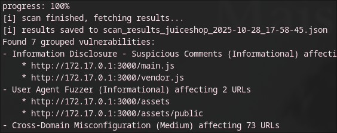

# Сканер анализ защищенности
CLI-утилита, которая использует ZAP для проверки уязвимостей. Сервис запускает ZAP active scan по URL активa, затем ожидает прогресс до 100% (периодически опрашивает ZAP).
После завершения получает алерты и сохраняет сгруппированные результаты в JSON. Вывод показывает уязвимости, риск, подробности, возможное решение, а также список затронутых URL.
## Перед началом работы:
```sh
go build -o scan main.go
```
## Функционал:
```sh
./scan add -name [name] -url [url]
./scan alerts -name [name]
./scan scan -name [name]
```
## Демонстрация работы:
### Добавление машины для сканирования:

Адрес записывается в файл assets.json


### Процесс сканирования:




### Результат сканирования:

Уязвимости группируются по названию и представляют из себя JSON файл.


